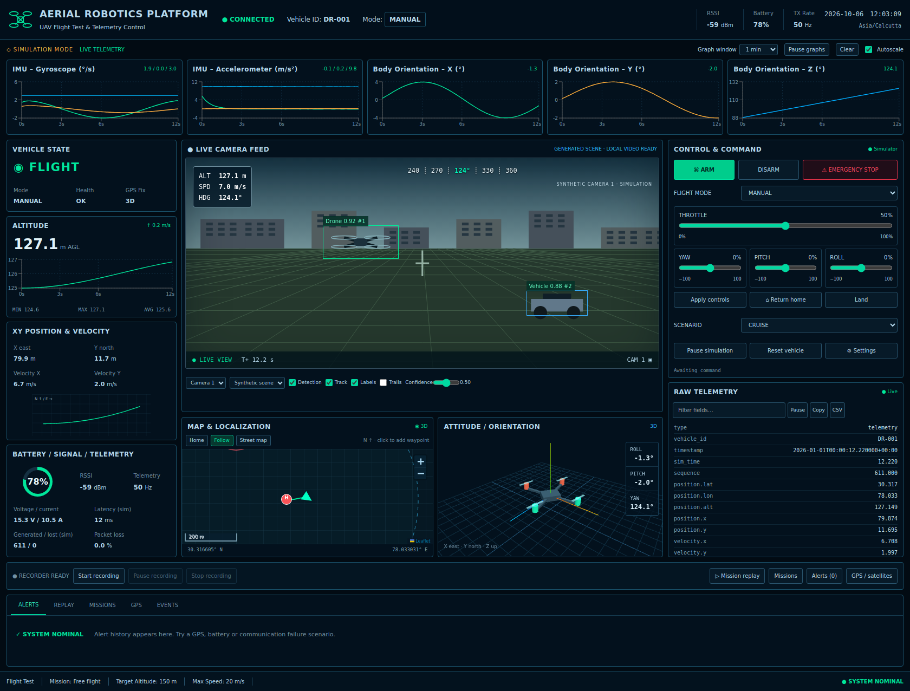

# Aerial Robotics Platform
### UAV Flight Test & Telemetry Control · DR-001 · MathTech


A runnable simulation-first ground station with a FastAPI backend, persistent SQLite recordings, WebSocket telemetry, a React dashboard, geographic mapping, and a Three.js quadrotor. Its compact dark instrumentation layout follows the supplied reference: five sensor charts above vehicle-state, camera, control and raw-data panels, with map and attitude panels beneath.

**All commands operate on the software simulator.** This is an engineering demonstrator, not certified flight software or a production-hardened fleet service. No aircraft, flight controller or camera purchase is needed.



## Quick start — Windows

1. Install **Python 3.12 (64-bit)**. The `py -3.12` launcher must work. Python 3.14 is not the tested version.
2. Extract this entire ZIP into a normal folder, for example `F:\projects\aerial-robotics-platform`.
3. Double-click **`start-windows.bat`**. The first launch installs Python dependencies and requires internet access.
4. Open **http://127.0.0.1:8000**. Leave the terminal open.

The ZIP includes a compiled frontend, so **Node.js is not needed for this quick start**. The simulator automatically starts in flight at 124.6 m, 78% battery and 14 satellites. Every dashboard instrument receives telemetry from the backend.

If you prefer PowerShell:

```powershell
cd F:\projects\aerial-robotics-platform
py -3.12 -m venv .venv
.\.venv\Scripts\python.exe -m pip install -r backend\requirements.txt
.\.venv\Scripts\python.exe -m uvicorn app.main:app --app-dir backend --host 127.0.0.1 --port 8000
```

These commands use the virtual environment directly; PowerShell execution-policy changes are unnecessary.

## Quick start — Linux / macOS

With Python 3.11 or 3.12 installed:

```bash
bash start.sh
```

Open http://127.0.0.1:8000. First-time dependency installation needs internet access. Thereafter the built dashboard and synthetic camera work locally. The map starts with an offline grid; optionally enable OpenStreetMap street tiles.

## Develop the source

Use Python 3.12 and Node.js 22 LTS (Node 24 also passed the build in this environment).

Terminal 1, project root:

```bash
python -m venv .venv
# Windows: use .venv\Scripts\python.exe instead of .venv/bin/python
.venv/bin/python -m pip install -r backend/requirements-dev.txt
.venv/bin/python -m uvicorn app.main:app --app-dir backend --reload --host 127.0.0.1 --port 8000
```

Terminal 2:

```bash
cd frontend
npm ci
npm run dev
```

Open http://127.0.0.1:5173. Vite proxies API and WebSocket traffic to port 8000. After editing frontend code, run `npm run build` to update the bundled dashboard used by the Python-only launcher.

## What works

| Area | Implemented behavior |
|---|---|
| Vehicle simulator | Fixed-step seeded motion, ENU position integration, velocity, acceleration, attitude, temperature, battery, GPS and signal |
| Scenarios | Hover, takeoff, climb, cruise, orbit, turn, descent, landing, GPS failure, low battery, communication failure, sensor anomaly |
| Telemetry | Validated schema; configurable 5–50 Hz generation and recording; 10 Hz bounded UI broadcast |
| Charts | Five IMU/orientation charts, altitude chart, XY trajectory; 10/30/60/300/600-second windows; pause, clear, autoscale and tooltips |
| Controls | Arm/disarm, validated sliders, flight modes, return home, landing, emergency latch, pause/resume/reset; persistent command results |
| Cameras | Procedurally generated scene, three synthetic view variants, local webcam and local video file playback |
| Perception | Explicitly synthetic detections with confidence, IDs, label toggles and recorded center-point trails |
| Map | Leaflet geographic coordinates, home, live path, heading, follow, zoom/pan, waypoint markers, geofence and illustrative no-fly zone |
| Attitude | Three.js quadrotor, grid, axes and interpolated rotation |
| Alerts | Battery, GPS, signal, packet loss, temperature, disconnect, emergency and geofence; acknowledgement and persistent history |
| Recording | Start/stop/pause/resume; full generated telemetry samples, commands, events and periodic detections persisted |
| Replay | Saved-sample loading, play/pause/stop/seek, 0.25–10× speed; charts/map/attitude/HUD share the replay source |
| Missions | Creation, validated lifecycle transitions, timeline, annotations and linked recordings |
| Export | Session JSON with telemetry, events, commands and detections; flattened telemetry CSV; raw snapshot CSV/copy |
| Settings | Simulation seed/speed, telemetry rate, alert thresholds, graph windows, appearance, API key connection |
| Storage | SQLite local database; SQLAlchemy schema compatible with PostgreSQL; Docker PostgreSQL configuration |
| Security | Optional environment-configured API key for all API calls and WebSockets, validation, CORS and WebSocket origin checks |

## Try a complete flight-test workflow

1. Watch the charts and altitude change; the marker moves and the 3D quadrotor rotates.
2. Open **Missions**, enter a name and create a mission. Change its status to RUNNING.
3. Optionally enable waypoint placement and click the map. These are planning annotations, not an autonomous waypoint controller.
4. Click **Start recording**. Change the scenario to ORBIT, CLIMB or HOVER.
5. Change slider values and click **Apply controls**. The status row shows the command ID and acceptance result.
6. Choose GPS FAILURE; after several simulated seconds, the satellite count falls and an alert appears. Acknowledge it. Reset restores nominal conditions.
7. Stop recording. Open **Mission replay**, refresh, select the session and load it. Move the timeline or play it at different speeds.
8. Export JSON/CSV. Choose **Return to live** to regain control of the simulator.

Emergency stop freezes the simulated craft immediately and latches the EMERGENCY state; Reset is required. Ordinary disarm is rejected above 1 m, so use Land first. This behavior is a simulation convenience and does not model real emergency descent.

## Docker Compose

Install Docker with Compose. Copy `.env.example` to `.env` and set `POSTGRES_PASSWORD` to a newly generated alphanumeric password. URL-reserved characters require URL encoding in the connection URL; alphanumeric avoids that issue. Optionally set `API_KEY`.

```bash
docker compose up --build
```

Open http://localhost:8080. Compose runs Nginx/frontend, FastAPI/backend and PostgreSQL. The database volume survives container restarts. `docker compose down` preserves the data volume; do not add `-v` unless you intend to delete it.

Docker configuration is supplied; see the verification report for which execution paths were actually tested.

## Configuration

Copy `.env.example` to `.env` for local overrides. Launch from the repository root. SQLite creates `aerial.db` there automatically. No credentials are included. The default local demo does not require login.

If you set `API_KEY`, open **Settings → API key**, enter it, then reconnect. The browser keeps this key only in session storage. The key is sent in an HTTP header and the first WebSocket frame, never in a URL query string. API docs are available at http://127.0.0.1:8000/docs; for authenticated deployments use an API client with `X-API-Key`.

Use a **single backend worker**: one process owns the simulator, recorder and broadcast queues. A multi-worker deployment needs an external simulation owner/message broker. Do not run multiple workers against one session database.

## Tests

Backend, from the project root:

```bash
.venv/bin/python -m pytest -q
```

Install `backend/requirements-dev.txt` first. Windows users substitute `.venv\Scripts\python.exe`.

Frontend, from `frontend/`:

```bash
npm test
npm run build
npx playwright install chromium
npm run test:e2e
```

The browser test starts Vite automatically. Start a backend on port 8000 first. **Use a disposable demo database for browser tests**: they operate the simulator, create a mission and record a session. Linux CI may need `npx playwright install --with-deps chromium`.

See [verification](docs/VERIFICATION.md), [API protocol](docs/API.md), [telemetry schema](docs/TELEMETRY.md), [architecture](docs/ARCHITECTURE.md) and [scope/limitations](docs/SCOPE.md).

## Structure

- `backend/app/main.py` — application lifespan, APIs, bounded WebSocket queues, recording coordinator.
- `backend/app/simulator.py` — adapter contract and deterministic simulation.
- `backend/app/services.py` — command validation and alert rules.
- `backend/app/schemas.py` — input and telemetry models.
- `backend/app/models.py` — SQLAlchemy models, relationships and database setup.
- `frontend/src/App.tsx` — dashboard layout, mission/control/settings workflows.
- `frontend/src/components/` — camera, charts, map, attitude and replay.
- `frontend/src/store.ts` — bounded telemetry store, live/replay isolation and reconnect.
- `frontend/dist/` — prebuilt dashboard for the Python-only launch path.
- `tests/`, `frontend/src/store.test.ts`, `frontend/e2e/` — backend, store and browser tests.
- `docs/` — screenshot, architecture, protocol, feature scope and verification.

## Troubleshooting

- **Disconnected:** keep the backend terminal running. Confirm `http://127.0.0.1:8000/api/system/status` returns JSON. If it returns 401, configure the API key in Settings.
- **Blank root page after source checkout:** run `npm ci` and `npm run build` inside `frontend`, then restart the backend. The ZIP already contains this build.
- **Port in use:** close the earlier server or change `--port`. For Vite development, also update its proxy target.
- **Python dependency build errors:** create a fresh Python 3.12 virtual environment; do not reuse a Python 3.14 environment.
- **Windows npm platform error:** never copy `node_modules` between operating systems. Use the included lockfile and run `npm ci` locally.
- **WebGL unavailable:** enable hardware acceleration in the browser. Numeric attitude remains visible even if the 3D context cannot initialize.
- **No map imagery:** the offline coordinate grid is the default. Street tiles require internet. All markers and trajectories work without tiles.
- **Webcam blocked:** allow camera permission on localhost or HTTPS; another program may own the device.
- **GPS recovery:** leave GPS FAILURE or press Reset. The simulation gradually reacquires satellites.
- **Mission replay list empty:** stop your recording and click Refresh. Recordings survive server restarts.

## Research extensions

Sensor fault analysis, command/state-machine experiments, telemetry compression, flight-test visualization, estimator comparison and replay-based anomaly detection. Real vehicle integration, WebRTC/RTSP gateways, production identity management, distributed brokers and high-fidelity dynamics remain future work.

MIT license applies to the included project code. Dependencies retain their own licenses. Optional OpenStreetMap tiles retain their displayed attribution.
