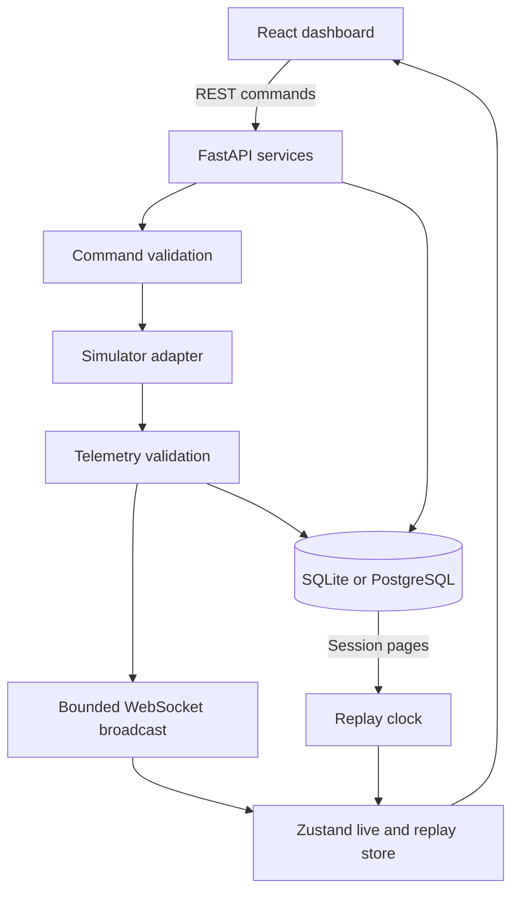

# Architecture

One asyncio task runs fixed simulation steps at configurable 5–50 Hz wall frequency. Simulation speed changes the simulated step size. At 50 Hz and 1× speed, `dt=0.02`. Real scheduling can run slower under load; the simulator does not claim hard real-time behavior.

The PRNG seed and command sequence at fixed steps determine the samples. Telemetry timestamps use a fixed 2026-01-01 UTC simulation epoch for repeatability. Database creation, command and event timestamps are real UTC times.

Telemetry is validated by Pydantic, held in a 30,000-sample server history buffer and recorded in batches approximately once per wall second. Live browser broadcasts run at at most 10 Hz. Each telemetry client has a two-message queue; slow clients get recent state rather than blocking the simulator. The browser retains at most 6,000 live frames (10 minutes at 10 Hz); charts draw approximately 220 points per graph. Persistence contains every generated recording sample, not only broadcast samples.

Database work is serialized on the application event loop. This is deliberately a single-process local architecture. Long database operations or large exports can interrupt the simulation cadence. PostgreSQL schema compatibility does not turn it into a distributed architecture.

Alerts have active and historical states. A changed severity creates a new alert; recovery resolves the previous one. Acknowledging an active alert does not erase the underlying fault. Events and commands are associated with the recording active at their creation. Mission events additionally carry a mission ID.

Replay loads pages of saved telemetry and derives playback timing from recorded simulation-time differences. On a recorded simulator reset, the negative time jump is represented by one nominal sample interval. Stored samples are never numerically reconstructed. The display selects the appropriate captured sample for each animation frame; high-speed playback can skip intermediate display frames. Live telemetry continues into a separate live buffer and does not replace replay state. UI flight controls are disabled during replay.

Vehicle commands pass through one validation service for REST and WebSocket callers. `VehicleAdapter` defines connect/disconnect/command/telemetry/status. `HardwareAdapter` deliberately raises NotImplementedError; there is no physical command transport.

The camera component owns webcam resource cleanup, local object URLs and the synthetic renderer. Detection values originate in simulator telemetry and are visibly synthetic. The 3D model is constructed from local Three.js geometry; no external model or CDN is required.
